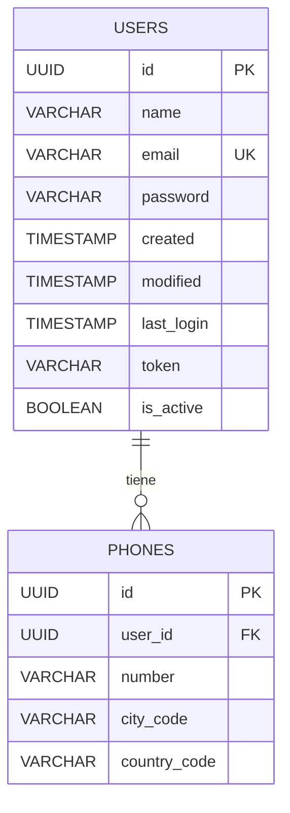
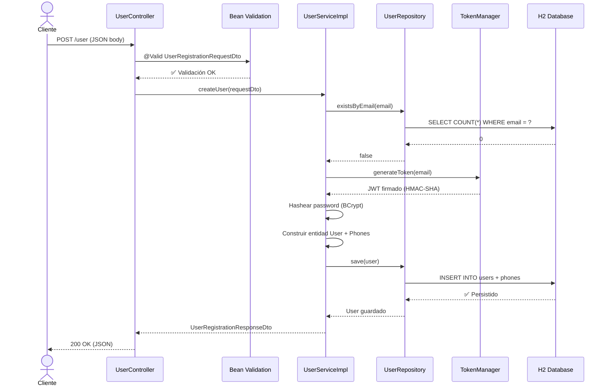
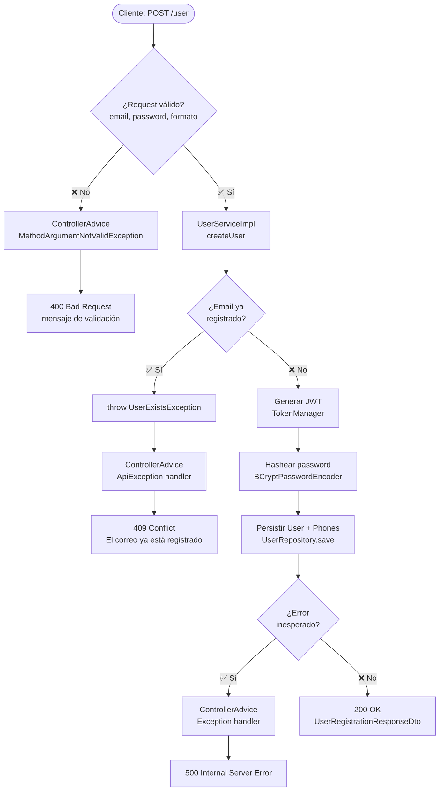
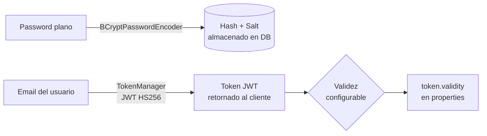

# RESTful Example API

API REST de registro de usuarios construida con **Spring Boot 3**, que demuestra buenas prácticas de arquitectura en capas, validación de entradas, manejo centralizado de excepciones y generación de tokens JWT.

---

## 📦 Stack Tecnológico

| Capa | Tecnología |
|---|---|
| Lenguaje | Java 21 |
| Framework | Spring Boot 3.5 |
| Seguridad | Spring Security + JWT (jjwt 0.11.5) |
| Persistencia | Spring Data JPA + Hibernate |
| Base de datos | H2 (in-memory, dev) |
| Validación | Jakarta Validation (Bean Validation) |
| Utilidades | Lombok, MapStruct |
| Build | Gradle |
| Tests | JUnit 5 + Spring Boot Test |

---

## 🏗️ Arquitectura en Capas

```
┌──────────────────────────────────────────┐
│              Cliente HTTP                │
└─────────────────┬────────────────────────┘
                  │
┌─────────────────▼────────────────────────┐
│           Controller Layer               │
│         UserController.java              │
│   - Recibe y valida el request HTTP      │
│   - Delegación a la capa de servicio     │
└─────────────────┬────────────────────────┘
                  │
┌─────────────────▼────────────────────────┐
│            Service Layer                 │
│         UserServiceImpl.java             │
│   - Lógica de negocio                   │
│   - Verificación de unicidad de email    │
│   - Generación de token JWT              │
│   - Construcción de entidades            │
└────────┬─────────────────┬───────────────┘
         │                 │
┌────────▼───────┐ ┌───────▼───────────────┐
│  Repository    │ │  Security              │
│  UserRepo.java │ │  TokenManager.java     │
│  (Spring Data) │ │  (JWT / HMAC-SHA)      │
└────────┬───────┘ └───────────────────────┘
         │
┌────────▼───────────────────────────────────┐
│           Persistence Layer                │
│    User (Entity) ←──OneToMany──→ Phone     │
│    H2 in-memory (dev)                      │
└────────────────────────────────────────────┘
```

---

## 🗂️ Estructura del Proyecto

```
src/main/java/com/santicabo/restful/
├── RESTFulExampleApplication.java
├── controller/
│   └── UserController.java          # Endpoint POST /user
├── service/
│   ├── UserService.java             # Interfaz del servicio
│   └── impl/
│       └── UserServiceImpl.java     # Lógica de negocio
├── repository/
│   └── UserRepository.java          # Spring Data JPA
├── model/
│   ├── User.java                    # Entidad principal
│   └── Phone.java                   # Entidad de teléfonos (1:N)
├── dto/
│   ├── UserRegistrationRequestDto.java   # Payload de entrada
│   ├── UserRegistrationResponseDto.java  # Payload de salida
│   └── ErrorDto.java                     # Respuesta de error
├── security/
│   ├── SecurityConfig.java          # Configuración Spring Security
│   └── TokenManager.java            # Generación de JWT
├── exception/
│   ├── ApiException.java
│   ├── UserExistsException.java
│   └── ControllerAdvice.java        # Manejo global de excepciones
└── validation/
    ├── AtLeastOneUpperCase.java
    └── AtLeastOneUppercaseValidator.java
```

---

## 🔌 Endpoints

### `POST /user` — Registrar usuario

**Descripción:** Registra un nuevo usuario en el sistema. Valida el email, la contraseña y genera un token JWT asociado al usuario creado.

#### Request

```http
POST /user
Content-Type: application/json
```

```json
{
  "name": "Juan Rodríguez",
  "email": "juan@rodriguez.org",
  "password": "Hunter2a",
  "phones": [
    {
      "number": 1234567,
      "citycode": "1",
      "contrycode": "57"
    }
  ]
}
```

#### Response exitosa — `200 OK`

```json
{
  "user": {
    "name": "Juan Rodríguez",
    "email": "juan@rodriguez.org",
    "password": "Hunter2a",
    "phones": [
      {
        "number": 1234567,
        "citycode": "1",
        "contrycode": "57"
      }
    ]
  },
  "userInfo": {
    "id": "550e8400-e29b-41d4-a716-446655440000",
    "created": "2024-01-15T10:30:00",
    "modified": "2024-01-15T10:30:00",
    "last_login": null,
    "token": "eyJhbGciOiJIUzI1NiJ9...",
    "isActive": true
  }
}
```

#### Respuestas de error

| HTTP Status | Causa | Ejemplo `mensaje` |
|---|---|---|
| `400 Bad Request` | Validación fallida (email, password) | `"email: Email debería seguir la notacion aaaaa@bbbbbb.xx"` |
| `409 Conflict` | El email ya está registrado | `"El correo ya está registrado"` |
| `500 Internal Server Error` | Error inesperado | `"Hubo un error inesperado: ..."` |

```json
{
  "mensaje": "El correo ya está registrado"
}
```

---

## ✅ Reglas de Validación

### Email
- Formato requerido: `palabras@dominio.ext`
- Patrón: `\w{1,100}@\w{1,100}(\.\w{2,3})?$`

### Password
- Al menos **una letra mayúscula**
- Al menos **dos dígitos numéricos**
- Solo **letras y números** (sin caracteres especiales)

---

## 🗄️ Modelo de Datos



---

## 🔄 Diagrama de Secuencia — Registro exitoso



---

## ⚠️ Diagrama de Flujo — Manejo de Errores



---

## 🔐 Seguridad

La seguridad es manejada por **Spring Security** con la siguiente configuración:

- **CSRF:** Deshabilitado (API stateless REST).
- **CORS:** Habilitado con configuración por defecto.
- **Autenticación:** Todos los endpoints son públicos (`permitAll()`), la seguridad se delega al token JWT retornado al registrarse.
- **Contraseñas:** Almacenadas con hash **BCrypt** (nunca en texto plano).
- **Token JWT:** Firmado con **HMAC-SHA256**, con tiempo de validez configurable.



> ⚠️ **Nota de seguridad:** El `token.secret` está hardcodeado en `application-dev.properties` solo a efectos de ejemplo. En producción debe externalizarse (variables de entorno, vault, etc.).

---

## ⚙️ Configuración y Ejecución

### Prerrequisitos
- Java 21+
- Gradle (o usar el wrapper incluido `./gradlew`)

### Variables de configuración (`application-dev.properties`)

| Propiedad | Descripción | Default (dev) |
|---|---|---|
| `server.port` | Puerto HTTP | `8090` |
| `token.secret` | Clave secreta JWT (Base64) | hardcodeada |
| `token.validity` | Validez del token en ms | `120` ms |
| `spring.datasource.url` | URL de la DB | H2 in-memory |
| `spring.h2.console.path` | Consola H2 | `/h2-console` |

### Ejecutar

```bash
./gradlew bootRun
```

La API estará disponible en: `http://localhost:8090`
Consola H2: `http://localhost:8090/h2-console`

### Ejecutar Tests

```bash
./gradlew test
```

---

## 🧪 Ejemplo con cURL

```bash
curl -X POST http://localhost:8090/user \
  -H "Content-Type: application/json" \
  -d '{
    "name": "Juan Rodríguez",
    "email": "juan@rodriguez.org",
    "password": "Hunter2a",
    "phones": [
      {
        "number": 1234567,
        "citycode": "1",
        "contrycode": "57"
      }
    ]
  }'
```

---

## 👤 Autor

**Santiago Cabo** — [@santicabo](https://github.com/santicabo)